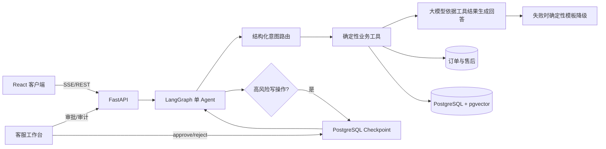

# 架构与数据流

## 一次请求的执行链路

1. FastAPI 从 JWT 读取可信 `customer_id`，验证当前客户有权访问会话。
2. LangGraph 路由节点将消息转换为 `RouteDecision`，真实模型不可用时使用确定性路由降级。
3. 工具节点查询订单、物流或 pgvector。订单号来自模型，但客户身份只能来自服务端上下文。
4. 查询类工具进入回答节点，大模型只能依据工具结果和知识引用组织自然语言；调用失败时使用确定性模板。售后写操作先运行确定性资格判断；符合条件才进入 `interrupt`。
5. 客服批准后，通过同一个 `thread_id` 恢复 checkpoint，再执行幂等写入。
6. 工具与模型生成的名称、成功状态、耗时、输出摘要和 Token 写入 `tool_traces`，客服工作台展示完整执行轨迹。

## 为什么不使用多 Agent

当前六个工具的职责清晰，单图即可表达所有状态。拆分多 Agent 会增加路由错误、Token 成本和调试难度，却没有带来可验证收益。只有评测证明单 Agent 无法维持工具选择准确率时才考虑拆分。
