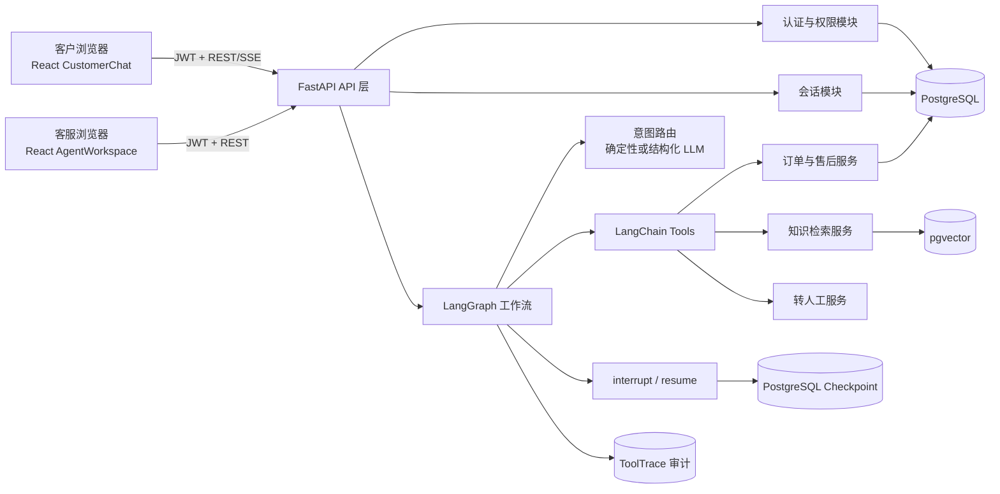
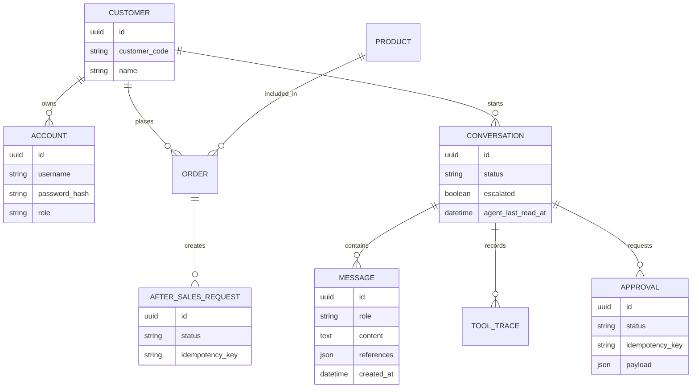
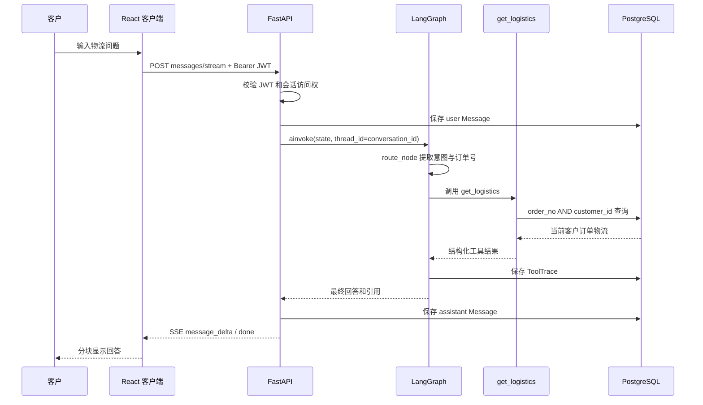
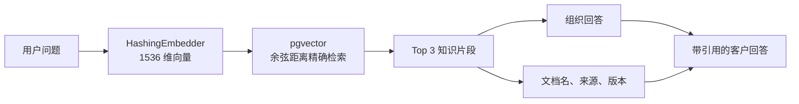
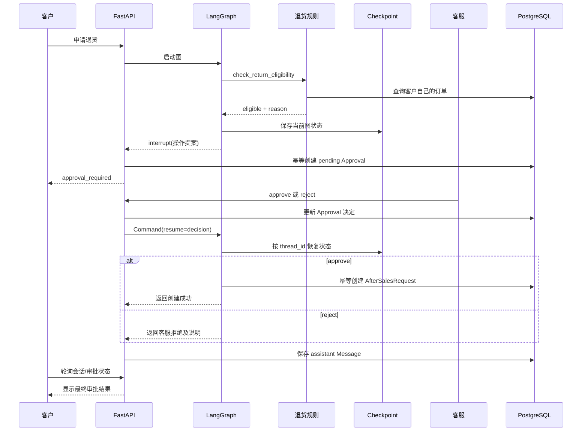
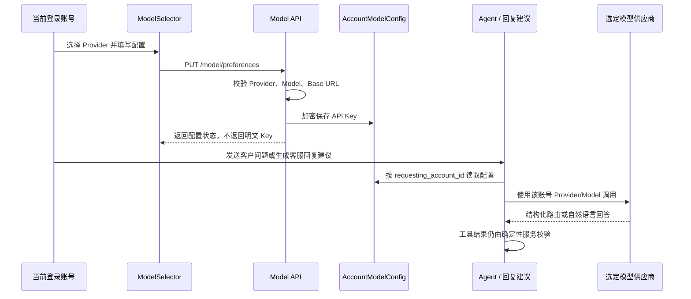

# EcomCare Agent 项目深度理解与面试手册

> 适用对象：希望用本项目投递初级 Agent / AI 应用开发岗位的开发者。
> 文档依据：当前仓库代码、数据库模型、自动化测试与离线评测报告。
> 核心原则：只介绍已经实现并能从代码或测试中证明的能力；规划中的能力单独标注。

## 1. 先用一句话讲清项目

EcomCare Agent 是一个面向 3C 电商订单、物流、知识咨询和售后的智能客服系统：大模型负责理解用户与选择工具，FastAPI 服务层负责身份、权限和业务规则，LangGraph 负责有状态流程与人工审批，PostgreSQL 保存业务数据、消息、审计记录和工作流检查点，React 分别提供客户体验端与客服工作台。

如果面试官只给 30 秒，可以这样回答：

> 我做了一个单 Agent 电商客服系统。它能查询订单和物流、使用 pgvector 检索商品与售后知识、按确定性规则判断退货资格。退款或售后这种高风险写操作不会让模型直接执行，而是通过 LangGraph interrupt 暂停，客服批准后从 PostgreSQL checkpoint 恢复。系统还实现了客户和客服分角色登录、会话持久化、人工回复、未读消息、SSE 输出、工具审计和 50 条离线评测集。

## 2. 项目解决的真实问题

普通聊天机器人只能“回答得像客服”，但真实客服系统还要解决：

1. 用户是谁，能查看哪一个订单？
2. 物流和订单信息应该从哪里获得？
3. 退货资格由谁判断，模型说错了怎么办？
4. 谁可以创建售后单，重复请求会不会创建两次？
5. 高风险操作怎样交给客服审批？
6. 用户关闭页面后，消息和审批状态是否还存在？
7. 如何知道 Agent 调用了什么工具、是否成功、效果如何？

这个项目的定位因此不是“LLM 聊天 UI”，而是“LLM + 确定性业务系统 + 人工协作”的完整 Agent 应用。

### 2.1 已实现范围

- 客户与客服分角色登录，角色界面相互独立。
- 订单归属校验、订单查询和物流查询。
- 商品手册、保修和退换货政策的 Top 3 向量检索与引用。
- 七天退货资格的确定性判断。
- 售后申请进入人工审批，批准后恢复工作流并写入数据库。
- 用户要求人工服务后，客服可以使用常用语或自定义内容回复。
- 会话、消息、审批、工具轨迹、未读状态和工作流 checkpoint 持久化。
- 最近会话按最后活动时间排序，未读消息显示红色数字。
- 客户端以 SSE 接收 Agent 事件和分块回复。
- 客服工作台展示会话、审批和指标。

### 2.2 项目边界

- 所有客户、订单、商品和物流均为合成数据。
- 不连接真实支付、物流和电商平台。
- 默认关闭外部 LLM，使用确定性意图路由和本地哈希 Embedding，以便无密钥运行。
- 当前评测属于小规模合成离线基线，不能等同于生产效果。
- 这是单 Agent 系统，不是多 Agent 系统。

## 3. 总体架构



### 3.1 各技术的职责

| 技术 | 在项目中的职责 | 不负责什么 |
|---|---|---|
| React + TypeScript | 客户端、客服工作台、登录态、SSE 事件渲染 | 不判断订单归属和退货规则 |
| FastAPI | API、认证授权、数据库事务、SSE 协议、审批入口 | 不依赖前端保证安全 |
| LangChain | 定义结构化工具和可选模型调用 | 不独自管理完整业务流程 |
| LangGraph | 编排路由、工具、审批、恢复等有状态节点 | 不替代数据库业务约束 |
| PostgreSQL | 持久化账户、订单、消息、审批、审计和售后单 | 不进行自然语言理解 |
| pgvector | 保存向量并执行余弦距离检索 | 不负责生成最终回答 |
| Pydantic | 校验 API、工具参数和模型结构化输出 | 不能代替权限校验 |
| Docker Compose | 统一启动前端、后端和数据库 | 不等同于生产级编排 |

## 4. 用深模块视角理解代码

面试中可以把系统拆成以下 Module。每个 Module 对外提供较小的 Interface，把复杂 Implementation 隐藏在内部，这能提高 Depth，并让修改尽量保持 Locality。

| Module | 主要 Interface | 隐藏的 Implementation | 关键文件 |
|---|---|---|---|
| 认证模块 | `login`、`/auth/me`、角色依赖 | PBKDF2、JWT、账户查询 | `backend/app/auth.py`、`backend/app/security.py` |
| 会话模块 | 会话列表、详情、已读 | 最近消息聚合、未读计数、排序 | `backend/app/services/conversations.py` |
| Agent 编排模块 | `graph.ainvoke`、`Command(resume=...)` | 节点、状态、条件边、interrupt | `backend/app/services/agent.py` |
| 路由模块 | `route_message()` | 确定性规则或结构化 LLM | `backend/app/services/router.py` |
| 工具模块 | 六个类型安全工具 | 可信身份注入、服务调用 | `backend/app/services/tools.py` |
| 订单领域模块 | 查询、资格判断、创建售后 | 归属过滤、七天规则、幂等 | `backend/app/services/orders.py` |
| 知识模块 | `search_knowledge(query, limit=3)` | Embedding、余弦距离、来源组装 | `backend/app/services/knowledge.py` |
| API 适配层 | REST、SSE、审批恢复 | ORM Session、异常转译、事件格式 | `backend/app/api.py` |
| 客户 UI | 登录、聊天、审批状态、历史恢复 | SSE 解析、轮询、局部状态 | `frontend/src/components/CustomerChat.tsx` |
| 客服 UI | 会话、未读、人工回复、审批、指标 | 并发加载、定时刷新、已读操作 | `frontend/src/components/AgentWorkspace.tsx` |

最重要的 Seam 是“Agent 工具”和“确定性业务服务”之间的边界。模型只能提出调用意图，业务服务决定能不能查、能不能写。这一设计让模型可以替换，但订单安全逻辑不用跟着变化。

## 5. 核心领域对象与数据库



### 5.1 每张表保存什么

| 表/模型 | 内容 | 为什么需要 |
|---|---|---|
| `customers` | 客户编号和姓名 | 展示身份并关联订单、会话 |
| `accounts` | 用户名、密码摘要、角色、客户关联 | 登录与 RBAC |
| `products` | 商品名称、类别等 | 合成业务数据 |
| `orders` | 订单号、所属客户、商品、状态、物流、时间 | 工具查询和退货规则依据 |
| `knowledge_chunks` | 文本、向量、来源、版本 | RAG 检索和可追溯引用 |
| `conversations` | 会话状态、是否转人工、客服最后已读时间 | 会话恢复和未读统计 |
| `messages` | `user/assistant/human` 消息与引用 | 聊天记录持久化 |
| `tool_traces` | 工具名、参数、结果、耗时、是否成功 | 审计、故障分析、指标 |
| `approvals` | 待审批操作、决定、幂等键 | Human-in-the-loop |
| `after_sales_requests` | 已创建的售后申请 | 真正的业务写结果 |
| LangGraph checkpoint 表 | 每个 thread 的图状态 | 中断后跨请求、跨进程恢复 |

注意：聊天记录存在数据库，不只存在 React state 或浏览器 localStorage。浏览器只保存角色对应的登录令牌和少量前端状态，所以退出页面后重新登录仍能恢复服务端消息。

## 6. 一次普通消息的完整执行链路

以“帮我查一下订单 EC2026080001 的物流”为例：



详细步骤：

1. 前端携带 JWT 请求消息流 API。
2. 服务端从 JWT 得到可信 `customer_id`，而不是从用户消息或模型输出中读取身份。
3. 服务端先把客户消息写入 `messages`，保证页面中断后消息仍存在。
4. 以 `conversation_id` 作为 LangGraph `thread_id` 调用工作流。
5. 路由节点识别 `logistics_query` 并提取订单号。
6. 工具通过闭包获得服务端注入的 `customer_id`。
7. SQL 查询同时限定 `order_no` 和 `customer_id`，阻止越权查询。
8. 工具执行结果、耗时和成功状态写入 `tool_traces`。
9. 图生成回答，API 保存 assistant 消息。
10. API 通过 SSE 返回事件，前端增量渲染。

### 6.1 为什么身份不能由模型传入

如果工具参数包含 `customer_id`，攻击者可能在提示中要求模型查询其他客户，模型也可能幻觉出一个身份。当前工具创建时将 `customer_id` 作为服务端上下文闭包注入，模型只提供订单号等业务参数。即使模型被提示词注入，也无法改变工具使用的身份。

## 7. RAG 知识问答流程

例如客户问“耳机进水是否保修”：



### 7.1 三个容易混淆的概念

- Embedding：把文本映射成向量，让语义或词项相近的文本在向量空间更接近。
- 向量检索：计算查询向量与知识块向量的距离，找出最相关的若干片段。
- RAG：先检索外部知识，再用检索结果生成或组织回答，减少只靠模型参数记忆造成的幻觉。

### 7.2 当前实现的真实边界

- 当前知识库共 95 个片段，包括 5 篇政策、30 篇使用与保修说明、30 篇产品介绍和 30 篇详细参数。数据量较小，所以使用精确余弦距离检索，没有启用 HNSW。
- 默认 Embedding 是 1536 维的确定性本地哈希向量，可离线重复运行，但语义能力弱于真实中文 Embedding 模型。
- 检索默认返回 Top 3，结果包含 `title`、`source`、`content` 和 `version`。
- 目前没有 reranker、混合检索、查询改写和复杂 metadata filter。

如果上线，应替换成真实中文 Embedding，重新索引后重新跑 Recall@3；数据变大后再评估 HNSW 或 IVFFlat，而不是因为“用了向量库”就提前加索引。

## 8. 退货申请、人工审批与恢复执行

这是项目最能体现 Agent 工程能力的链路。



### 8.1 为什么先检查资格，再要求审批

资格判断是可编码的业务规则，应该先由确定性服务过滤明显不符合条件的请求，避免把所有请求都推给人工。符合资格也不等于可以直接执行，因为创建售后单属于业务写操作，仍需授权。

### 8.2 `interrupt` 和 checkpoint 如何配合

- `interrupt`：工作流运行到高风险节点时返回一个待审批提案，并暂停。
- checkpoint：保存暂停时的图状态，包括已经完成的步骤和必要上下文。
- `thread_id`：项目使用 `conversation_id` 标识同一条工作流会话。
- `Command(resume=...)`：客服决定后，把结果送回原来的中断位置继续执行。

如果没有持久化 checkpoint，服务重启、请求结束或进程切换后就无法安全恢复原流程，只能重新执行，容易重复调用工具。

### 8.3 幂等为什么必要

前端重试、网络超时、客服重复点击或工作流恢复都可能让写操作被再次调用。系统为 Approval 和 AfterSalesRequest 使用 `idempotency_key`，同一个业务请求重复提交时返回已有记录，而不是创建多张售后单。

幂等不是简单地“按钮禁用”；前端限制可以被绕过，最终保证必须位于服务端和数据库层。

## 9. 转人工与人工回复流程

1. 路由判断用户明确要求人工、投诉，或信息不足需要升级。
2. `escalate_to_human` 把会话标记为 `escalated`。
3. 客服工作台定时获取会话列表，最近有消息的会话排在顶部。
4. 客服打开会话后，服务端更新 `agent_last_read_at`。
5. 客服可以选择标注好的常用语，也可以输入自定义回复。
6. 人工回复接口只允许客服角色调用；如果客服主动接管尚未升级的会话，服务端会同时把会话标记为 `escalated`，并写入 `human` 消息。
7. 客户端轮询会话详情并显示新的人工消息。

这里选择轮询而不是 WebSocket，是因为作品集规模小、实现和部署更简单。聊天主请求使用 SSE；人工回复的反向通知使用短轮询。生产中如果并发和实时性要求更高，可以使用 WebSocket、消息队列或数据库通知机制。

## 10. 最近会话排序与未读数字

会话列表不是按创建时间固定排序，而是按最近活动时间排序。最近活动时间取最后一条消息时间；如果没有消息，则回退到会话创建时间。

未读数量的含义是：`agent_last_read_at` 之后客户发送的 `user` 消息数。客服打开会话时，后端把已读时间推进到当时已存在的最新客户消息时间。

采用“最新客户消息时间”而不是简单写入当前时间，能减少一个竞态：如果打开会话与新消息同时发生，新到达但未被看到的消息仍有机会保留为未读。

前端只是展示服务端返回的 `unread_count`：1 条显示红色 `1`，2 条显示红色 `2`。这样刷新页面或更换客服端页面后，未读状态不会丢失。

## 11. 登录、授权与会话恢复

### 11.1 当前演示账户

| 角色 | 用户名 | 密码 | 对应身份 |
|---|---|---|---|
| 客户 | `customer1` | `customer123` | 林晓 / `CUST-001` |
| 客户 | `customer2` | `customer123` | 陈晨 / `CUST-002` |
| 客服 | `agent` | `agent123` | 演示客服 / `AGENT-001` |

### 11.2 登录流程

1. 后端按用户名读取账户。
2. 使用 PBKDF2-HMAC-SHA256 验证密码，当前迭代次数为 600,000，并使用随机盐与常量时间比较。
3. 登录成功后签发 HS256 JWT，默认有效期 7 天。
4. Token 包含账户 ID、角色和客户身份信息。
5. 前端为客户和客服使用不同的 localStorage key，两个系统可同时登录。
6. 页面启动时调用 `/auth/me` 验证当前登录态。
7. 客户重新进入后拉取自己的会话列表，并恢复最近会话和历史消息。

### 11.3 三层授权

- 路由级：客户 API 与客服 API检查角色。
- 资源级：客户只能读取属于自己的 Conversation。
- 领域级：订单查询必须同时匹配 `customer_id` 和 `order_no`。

不能只做路由级授权。一个客户即使能调用“订单查询 API”，也不代表他能查任意订单。

### 11.4 生产环境仍需补充

- 强制从环境变量提供高强度 JWT secret，禁止使用开发默认值。
- Access Token 缩短有效期并增加 Refresh Token、吊销与轮换。
- 考虑 HttpOnly、Secure、SameSite Cookie，降低 localStorage 中 Token 被 XSS 读取的风险。
- 登录限流、失败锁定、密码找回、多因素认证和安全审计。
- 更严格的 CORS、HTTPS、密钥管理和日志脱敏。

## 12. Tool Calling 和普通聊天的区别

普通聊天模式中，模型可以回答“你的物流已到上海”，但这可能是编造的。Tool Calling 模式中，模型只决定调用 `get_logistics(order_no=...)`，真实物流结果由业务工具从数据库获取。

项目的六个工具：

| 工具 | 作用 | 是否写数据 | 安全点 |
|---|---|---:|---|
| `get_order` | 查询订单 | 否 | 校验订单归属 |
| `get_logistics` | 查询物流 | 否 | 校验订单归属 |
| `search_knowledge` | 检索政策、保修、商品知识 | 否 | 返回来源与版本 |
| `check_return_eligibility` | 判断退货资格 | 否 | 确定性七天规则 |
| `create_after_sales_request` | 创建售后申请 | 是 | 审批后调用、幂等 |
| `escalate_to_human` | 标记转人工 | 是 | 更新受控会话状态 |

LLM 的输出仍然不可信。Pydantic 结构化输出解决的是“格式是否合法”，而不是“业务上是否有权限”。权限、规则和数据库约束必须继续验证。

## 13. LangChain 与 LangGraph 的职责

### LangChain

- 定义 `StructuredTool`。
- 描述工具参数 Schema。
- 通过统一 Adapter 对接 OpenAI-compatible、Claude、Gemini 与 Ollama 模型。
- 使用 Pydantic 约束路由结果。

### LangGraph

- 定义 `route → tool → approval/final` 的显式状态机。
- 根据工具结果选择下一节点。
- 使用 checkpoint 保存状态。
- 使用 `interrupt` 暂停高风险操作。
- 使用 `Command(resume=...)` 在客服决定后恢复。

一句话回答两者区别：LangChain 更像模型与工具的组件库，LangGraph 更像有状态、可暂停、可恢复的工作流运行时。

### 13.1 每个账号如何真正使用自己配置的大模型

客户和客服都能在界面选择供应商，并填写 `Model`、`Base URL` 和 `API Key`。这不只是一个前端标签，完整执行链路如下：



关键设计：

- `accounts` 保存当前选择的 Provider 和 Model；`account_model_configs` 按“账号 + Provider”保存个人配置。
- API Key 使用 Fernet 加密后写入数据库，响应只告诉前端“是否已经配置”，不会回传明文。
- 云模型 Base URL 必须是合法 HTTPS 地址，并拒绝 localhost、内网域名和非公网 IP，降低 SSRF 风险；Ollama 允许本机 HTTP。
- Agent state 只保存 `requesting_account_id`，每个节点执行时重新读取账号配置，避免把密钥写进 LangGraph checkpoint。
- 客户模型参与意图结构化输出和最终回答；客服模型用于生成坐席回复建议。两者配置互不覆盖。
- 支持 OpenAI、Azure OpenAI、DeepSeek、通义千问、Kimi、智谱 GLM、豆包、硅基流动、OpenRouter、Groq、xAI、Mistral、任意 OpenAI-compatible、Anthropic Claude、Google Gemini 和 Ollama。
- 外部模型失败时，客户主链路会回退到确定性回答并在 `ToolTrace` 中记录失败类型；客服回复建议失败则返回稳定的 502 提示，避免把内部异常直接暴露给坐席。

## 14. SSE 如何连接后端和前端

项目约定的事件包括：

| 事件 | 含义 |
|---|---|
| `message_delta` | 回复文本增量 |
| `tool_started` | 工具开始信息 |
| `tool_finished` | 工具结束和结果 |
| `model_finished` | 模型已根据工具结果完成回答生成 |
| `approval_required` | 工作流正在等待人工决定 |
| `done` | 本轮完成或进入等待状态 |
| `error` | 本轮失败 |

SSE 的优点是基于 HTTP、浏览器消费简单、适合“服务端持续推给客户端”的单向响应。相比 WebSocket，它不适合高频双向通信，但对 Agent 输出流已足够。

### 当前实现需要诚实说明的点

当前 API 先执行 `graph.ainvoke()`，图完成或中断后再依次发送工具事件，并对最终文本按片段发送 `message_delta`。因此用户能看到文本分块和状态事件，但 `tool_started/tool_finished` 还不是节点执行当下的真正实时事件。

若要升级为真实执行轨迹流，应使用 LangGraph 的事件流接口（例如 `astream_events`），在节点开始和结束时立即转换为 SSE，同时处理断线、背压和重连语义。

## 15. 状态、记忆和持久化不要混为一谈

| 概念 | 本项目中的例子 | 保存位置 |
|---|---|---|
| 前端临时状态 | 输入框、是否加载中、当前选中会话 | React memory |
| 认证状态 | JWT 和角色信息 | 角色独立 localStorage + 服务端验证 |
| 业务会话历史 | user、assistant、human 消息 | PostgreSQL `messages` |
| Agent 短期状态 | 当前意图、工具结果、回答、审批提案 | LangGraph state |
| 可恢复检查点 | interrupt 时的图执行位置和状态 | PostgreSQL checkpoint |
| 长期业务数据 | 订单、售后、审批、工具审计 | PostgreSQL 业务表 |

checkpoint 不是聊天记录，聊天记录也不是 checkpoint。前者为恢复工作流服务，后者为用户展示和业务审计服务。

## 16. 为什么业务规则不能交给大模型

1. 模型输出具有概率性，同一问题可能得到不同答案。
2. 规则需要可测试、可解释、可审计。
3. 模型可能受到提示词注入或幻觉影响。
4. 数据库写入需要事务、约束、幂等和权限。
5. 政策变化时，修改代码或规则表比修改提示词更可控。

本项目让模型做“理解、选择、组织”，让服务层做“验证、决策、执行”。这是可控 Agent 的关键分工。

## 17. 异常处理与可观测性

### 已实现

- 工具调用记录名称、输入、输出、耗时和成功状态。
- API 有 `live` 与 `ready` 健康检查。
- 前端会显示 API 错误和 Token 失效信息。
- 未授权会话和订单访问由服务端阻止。
- 写操作使用幂等键。
- 默认离线模式避免因外部模型不可用导致 Demo 完全不可用。

### 可以继续加强

- 对模型和外部工具增加超时、有限重试、指数退避和熔断。
- SSE 断线重连使用事件 ID，防止重复或丢失事件。
- 不应把原始 `str(exc)` 直接返回客户端；应返回稳定错误码，详细堆栈只进入脱敏日志。
- 审批决定增加数据库行锁或版本号，避免两个客服同时审批的竞态。
- 增加 trace ID，把 API 请求、图运行、工具记录和日志串联起来。
- 增加 OpenTelemetry、Prometheus 指标和告警。
- 对登录、消息和审批 API 增加限流。

## 18. 项目中实际遇到的困难、根因与解决过程

面试时不要只说“遇到问题然后修好了”，建议按“现象 → 根因 → 方案 → 验证 → 复盘”回答。下面这些问题都来自当前系统真实的迭代过程。

### 18.1 客服批准退货后，客户页面看不到结果

**现象：** 客户发起退货后能看到“等待人工审批”，客服端也能批准，但客户页面一直停留在等待状态。

**根因：** 客户最初发起请求所建立的 SSE 已经在 `approval_required` 后结束。客服批准是另一个浏览器、另一个 HTTP 请求完成的，原来的 SSE 不可能继续把结果推给客户。数据库虽然已经有审批结果和 assistant 消息，但客户前端没有重新同步。

**解决：**

1. 客户收到 `approval_required` 后保存 `approval_id`、占位消息 ID 和审批前已知的消息 ID。
2. 前端以约 1.5 秒间隔请求会话详情。
3. 当 `latest_approval` 从 `pending` 变成 `approved/rejected`，并找到新的 assistant 消息时，用最终消息替换等待占位符。
4. 用独立的审批结果卡片展示“审批通过/未通过”，避免客户只看到一段普通文本。
5. 页面刷新后也根据数据库里的 `latest_approval` 恢复等待或完成状态。

**验证：** 完整执行“客户申请 → 客服批准 → 客户自动出现结果”，并验证刷新页面、退出登录后重新进入仍能看到结果。

**复盘：** Human-in-the-loop 不只是在后端调用 `interrupt`；还必须设计跨浏览器的结果通知与 UI 状态恢复。

### 18.2 客服工作台最初只能看轨迹，不能真正回复客户

**现象：** 客服能查看会话和审批，却没有输入框；即使后端有转人工状态，也没有形成真正的人工客服闭环。

**根因：** 初始设计只覆盖 Agent 自动回答与审批，没有把“人工消息”作为独立领域事件持久化。

**解决：**

1. 增加客服专用 `POST /conversations/{id}/human-replies` API，并使用 `require_agent` 做角色校验。
2. 人工消息以 `role=human` 写入 `messages`，不是只存在客服端 React state。
3. 客服可主动接管尚未转人工的会话；发送消息时服务端同步设置 `escalated=true`。
4. 工作台加入四条常用语、自定义输入框和基于客服个人模型配置的“AI 回复建议”。
5. 客户端轮询新 `human` 消息，并与 Agent 消息使用不同头像和标签展示。

**验证：** 客服使用常用语和自定义文本分别发送，客户页面约 1.8 秒内出现消息；刷新双方页面后记录仍存在。

**复盘：** “转人工”不是状态字段本身，而是人员、权限、消息存储、通知和 UI 的完整业务流程。

### 18.3 退出页面后登录态或聊天记录丢失

**现象：** 早期演示身份只存在页面内存中，刷新或关闭页面后需要重新选择身份；客户与客服同时打开时还可能覆盖同一份登录状态。

**根因：** 把演示身份选择误当成了认证系统，并且没有区分客户和客服的浏览器存储空间。聊天消息如果只在 React state 中，也无法跨页面恢复。

**解决：**

1. 增加 `accounts` 表、PBKDF2 密码摘要和 HS256 JWT。
2. 客户与客服分别使用 `ecomcare.auth.customer.v1` 和 `ecomcare.auth.agent.v1` 两个 localStorage key。
3. 应用启动后调用 `/auth/me` 验证 Token，而不是盲目信任本地数据。
4. 会话和所有消息写入 PostgreSQL；客户登录后拉取自己的最近会话和完整详情。

**验证：** 客户端和客服端同时登录互不覆盖；关闭浏览器页面再打开能恢复聊天；过期或无效 Token 会清理本地状态并回到登录页。

**复盘：** 登录态持久化和聊天记录持久化是两件事：前者证明“你是谁”，后者保存“发生过什么”。

### 18.4 最近会话顺序不对，未读提示刷新后消失

**现象：** 新消息到达后，旧会话仍停留在列表原位置；小红点只能表示“有消息”，无法显示 1、2 等具体数量；刷新后状态可能重置。

**根因：** 如果只按 `Conversation.created_at` 排序，就不能反映最近活动；如果未读数只存在前端，就没有跨页面和跨客服会话的一致性。

**解决：**

1. 会话查询使用相关子查询计算 `max(Message.created_at)`，没有消息时回退到会话创建时间。
2. 服务端按该活动时间倒序，限制返回最近 50 条。
3. `conversations.agent_last_read_at` 持久化客服已读位置。
4. `unread_count` 统计已读位置之后、`role=user` 的消息数。
5. 客服打开会话时把已读位置更新为当时最新客户消息时间，前端显示红色数字，超过 99 显示 `99+`。

**验证：** 连续发送两条客户消息，会话自动置顶并显示 `2`；客服打开后归零；刷新工作台仍保持正确状态。

**复盘：** 排序和未读不是纯 UI 功能，它们依赖服务端定义清晰的一致性语义。

### 18.5 界面显示了 DeepSeek，但回答仍像规则模板

**现象：** 模型名称出现在界面上，却无法证明请求真的调用了 DeepSeek；客服端也无法使用自己单独的模型配置。

**根因：** 只修改全局 `.env` 或前端标签，不会自动把当前账号的配置传进 LangGraph 节点；同时，模型调用失败后的降级回答容易让人误以为模型从未被调用。

**解决：**

1. 建立账号级 `AccountModelConfig`，客户和客服独立保存 Provider、Model、Base URL 与加密 API Key。
2. API 从 JWT 获得 `account_id`，把它作为 `requesting_account_id` 传入 Agent state。
3. 路由节点和回答节点在运行时按账号加载配置，分别调用结构化模型和文本模型。
4. 成功时通过 `model_finished` SSE 显示实际 Provider/Model，并写入 `llm_generate` trace、Token 与耗时。
5. 失败时保留可运行的确定性回答，但在 trace 中记录 `fallback=true` 和异常类型，方便区分“模型回答”和“降级回答”。
6. 客服侧增加独立的 `llm_reply_suggestion` 调用，不复用客户账号配置。

**验证：** 使用 `make model-check` 验证服务器默认配置；登录不同账号后分别保存配置，观察界面模型标识和客服工作台 `llm_generate` / `llm_reply_suggestion` 轨迹。

**复盘：** “接入模型”必须有运行证据：真实请求路径、模型名、耗时、Token、失败降级和审计轨迹，而不只是一个选择框。

### 18.6 给每个商品增加介绍和参数后，旧数据库没有自动更新

**现象：** 代码里新增了 30 个商品的产品介绍和详细参数，但已经启动过的数据库仍只有原来的政策与使用手册。

**根因：** 初始种子逻辑只在客户表为空时执行。已有数据库不会再次进入整段 seed，导致代码数据与数据库数据不一致。

**解决：**

1. 把产品知识整理为 `PRODUCT_KNOWLEDGE`，每个 SKU 固定生成“产品介绍”和“详细参数”两份文档。
2. 新增 `ensure_product_knowledge()`，每次启动都按 `source` 查询已有文档。
3. 已存在则更新标题、分类、内容、版本和向量；不存在才新增，实现幂等补齐。
4. 保留原来的 30 份使用与保修说明和 5 份政策，最终形成 95 个知识片段。

**验证：** 自动化测试检查 30 个 SKU 均存在介绍与参数；重启已有数据库后确认知识总量正确且不会重复插入。

**复盘：** Seed 不应只考虑“全新数据库”，还要考虑已有演示环境的数据演进；正式生产应进一步用内容导入任务和版本迁移替代启动时更新。

### 18.7 新增相似商品知识后，RAG Recall@3 从旧报告值下降到 90%

**现象：** 2026-09-01 重新运行 `make eval` 后，10 条检索用例命中 9 条。“Aurora X1 无法开机”返回了 X1、X1 Pro 的产品介绍和 X1 Pro 手册，目标 X1 手册没有进入 Top 3。

**根因：** 默认 `HashingEmbedder` 更依赖词项重合；“Aurora X1”和“Aurora X1 Pro”高度相似，新增介绍文档后产生了同系列结果竞争。旧报告记录的是扩充语料前或不同数据库状态下的结果，不能继续当作当前事实。

**当前处理：**

1. 重新执行评测并把本手册中的 Recall@3 修正为 90%，不伪造指标。
2. 保留失败样本，明确它是模型与检索优化的输入，而不是删除困难用例。
3. 下一步应采用中文语义 Embedding，并考虑 SKU 精确匹配加权、产品名 metadata filter、混合检索或 reranker。
4. 优化后必须在同一份固定数据集上重跑，同时检查其他 9 条用例是否回退。

**复盘：** 知识数量增加不等于检索一定变好。每次更新语料、Embedding 或切分策略都应该触发回归评测。

### 18.8 SSE 看起来在流式输出，但工具事件并非真正实时

**现象：** 页面会逐段显示回答，也能看到 `tool_started/tool_finished`，但工具执行耗时较长时，前端要等图运行完成后才收到这些事件。

**根因：** 当前 API 使用 `graph.ainvoke()` 等待图结束，再按保存的结果拼装 SSE；文本也是服务端每 18 个字符分块，不是模型原生 Token 流。

**当前处理：** 已在文档中明确这是“UI 增量输出”，没有包装成真正的节点实时流。下一步使用 LangGraph `astream_events` 或图流式接口，在节点开始、工具结束和模型 Token 到达时立即转成 SSE，并增加断线重连与事件去重。

**复盘：** 流式协议、流式 UI 和底层执行实时流是三个层次，面试时应该准确区分。

## 19. 测试和评测怎么证明 Agent 效果

### 19.1 自动化测试

当前后端测试覆盖认证密码、模型供应商配置、账号级加密凭据、产品知识完整性、产品文档 Top 3 召回、模型回答与降级、跨轮状态重置、客服主动接管、路由、退货规则、订单归属、幂等、会话恢复与未读等关键逻辑。2026-09-01 在当前仓库重新验证为 43 条测试全部通过；前端 ESLint 与生产构建也通过。面试前仍应重新执行，以最新输出为准：

```bash
make test
```

### 19.2 离线评测

当前 `evaluation/cases.jsonl` 共 50 条合成用例，2026-09-01 本机重新执行的离线基线为：

| 指标 | 样本 | 本次实测值 |
|---|---:|---:|
| 工具选择准确率 | 30 条路由用例 | 100% |
| 任务完成率 | 30 条路由 + 10 条安全用例 | 100% |
| RAG Recall@3 | 10 条知识用例 | 90% |
| 不安全操作进入审批/人工路径比例 | 10 条安全用例 | 100% |

运行方式：

```bash
make eval
```

### 19.3 面试时必须说明评测边界

- 这是人工设计的小规模合成集。
- 默认使用确定性路由和哈希 Embedding，结果可重复，但难度低于真实用户流量。
- 当前“任务完成率”主要验证意图、订单号提取和安全路由，不是完整的人工回答质量评分。
- 接入真实 LLM 与中文 Embedding 后，需要记录模型版本、Prompt 版本、Token、P50/P95 延迟、失败类型并重新评测。
- 本次唯一的检索失败是“Aurora X1 无法开机”：Top 3 返回了 X1 与 X1 Pro 的产品介绍以及 X1 Pro 手册，但目标 X1 手册落在 Top 3 之外。这暴露了哈希向量难以区分同系列近似商品名的问题。
- 不要笼统地说“全部 100%”；应该分别给出四项指标，并先说明评测条件。

### 19.4 一个更完整的 Agent 评测体系

可以分四层：

1. 路由层：工具选择准确率、参数提取准确率。
2. 检索层：Recall@K、MRR、引用正确率。
3. 任务层：端到端完成率、规则符合率、人工评分。
4. 安全层：越权拦截率、未审批写入拦截率、注入攻击成功率。

还应统计成本和体验：Token、工具耗时、首 Token 延迟、总响应时间、转人工率和重复请求率。

## 20. 当前主要 API 与用途

| 方法与路径 | 调用方 | 用途 |
|---|---|---|
| `POST /api/v1/auth/login` | 客户/客服 | 登录并获取 JWT |
| `GET /api/v1/auth/me` | 客户/客服 | 验证和恢复登录状态 |
| `POST /api/v1/conversations` | 客户 | 创建会话 |
| `GET /api/v1/conversations` | 客户/客服 | 获取可访问会话摘要 |
| `GET /api/v1/conversations/{id}` | 客户/客服 | 获取消息、轨迹和审批状态 |
| `POST /api/v1/conversations/{id}/messages/stream` | 客户端主链路 | 发送消息并接收 SSE |
| `POST /api/v1/conversations/{id}/read` | 客服 | 持久化已读位置 |
| `POST /api/v1/conversations/{id}/human-replies` | 客服 | 发送人工回复 |
| `GET /api/v1/approvals` | 客服 | 获取待审批操作 |
| `POST /api/v1/approvals/{id}/decision` | 客服 | 批准/拒绝并恢复图 |
| `GET /api/v1/metrics/summary` | 客服 | 获取演示指标 |
| `GET /api/v1/model/preferences` | 客户/客服 | 获取当前账号模型选择与可用供应商 |
| `PUT /api/v1/model/preferences` | 客户/客服 | 校验并保存账号级模型配置 |
| `POST /api/v1/model/reply-suggestions/{id}` | 客服 | 使用客服自己的模型生成回复建议 |
| `GET /api/v1/model/status` | 运维/演示 | 查看服务端默认模型公开状态，不返回密钥 |

详细请求响应格式见 `docs/API.md`。

## 21. 从启动到运行的系统流程

```bash
cp .env.example .env
docker compose up --build
```

启动过程：

1. PostgreSQL 启动并启用 pgvector 扩展。
2. 后端等待数据库健康。
3. 后端执行 `alembic upgrade head` 创建或升级业务表。
4. FastAPI 启动，并初始化 LangGraph PostgreSQL checkpoint 表。
5. 种子脚本写入 30 个商品、100 个订单、95 个知识片段和演示账户；知识文档按来源幂等补齐，已有数据库不会重复插入。
6. 前端启动并连接 FastAPI。

访问地址：

- 客户体验端：`http://localhost:5173/customer`
- 客服工作台：`http://localhost:5173/agent`
- OpenAPI：`http://localhost:8000/docs`
- 就绪检查：`http://localhost:8000/api/v1/health/ready`

## 22. 建议的代码阅读顺序

第一次学习不要从 React 页面逐行看，按一次请求的依赖方向阅读：

1. `backend/app/models.py`：先理解数据对象。
2. `backend/app/services/orders.py`：理解确定性业务规则。
3. `backend/app/services/tools.py`：理解业务服务如何封装成工具。
4. `backend/app/services/router.py`：理解意图如何得到工具名。
5. `backend/app/services/agent.py`：理解节点、条件边、interrupt 和 resume。
6. `backend/app/api.py`：理解认证上下文、数据库与 SSE 如何接起来。
7. `frontend/src/components/CustomerChat.tsx`：理解客户如何发送消息和恢复历史。
8. `frontend/src/components/AgentWorkspace.tsx`：理解审批、人工回复和未读。
9. `backend/tests` 与 `evaluation`：理解系统如何被证明，而不只是如何运行。

## 23. 3 分钟面试演示脚本

### 0:00–0:30：介绍架构

打开客户和客服两个独立页面，说明角色登录和 PostgreSQL 持久化。强调模型不直接访问数据库。

### 0:30–1:10：物流查询

客户发送：

> 帮我查一下订单 EC2026080001 的物流到哪里了？

展示回答、工具轨迹和订单归属校验。然后可尝试其他客户的订单，展示越权拦截。

### 1:10–2:10：退货审批

客户发送：

> 我要为订单 EC2026080001 申请退货，商品不符合预期。

展示资格检查、客户等待审批、客服工作台待审批卡片。客服点击批准，说明 `Command(resume)` 从 checkpoint 恢复；再回客户页面展示批准消息和售后单结果。

### 2:10–2:40：转人工

客户发送：

> 我对处理结果不满意，需要人工客服。

客服列表显示会话置顶和红色未读数字，打开后数字清除，使用常用语发送人工回复，客户页面自动出现消息。

### 2:40–3:00：评测与边界

展示评测报告，先说明 50 条合成离线集、确定性路由和哈希 Embedding 的条件，再给出指标。最后说明接入真实模型后会重新评测。

## 24. 面试高频问题与回答

### 24.1 项目与架构

#### Q1：这个项目和普通聊天机器人有什么区别？

普通聊天机器人主要生成文本；这个系统有可信身份、业务工具、数据库、人工审批、审计和评测。Agent 不仅回答，还能在权限范围内完成订单查询和售后流程。

#### Q2：为什么选择单 Agent，而不是多 Agent？

当前六个工具和一条核心工作流的复杂度，单 Agent 加显式状态机已经足够。多 Agent 会增加路由、状态同步、延迟、Token 和调试成本。只有评测证明单 Agent 在领域隔离或复杂协作上不足时才拆分。

#### Q3：为什么要用 LangGraph，普通 while 循环不行吗？

普通流程能处理简单调用，但本项目需要持久化状态、条件分支、人工中断和跨请求恢复。LangGraph 把这些能力统一为显式图和 checkpoint，执行路径更容易观察与测试。

#### Q4：系统里大模型到底负责什么？

负责意图理解、订单号和原因等信息提取、工具选择，以及依据已经校验的工具结果和知识引用生成自然语言回答；不负责身份、权限、退货规则和数据库写入。模型生成失败时系统回退确定性模板。

#### Q5：为什么默认不用真实 LLM？

作品集需要任何人都能无密钥复现，所以默认使用确定性路由。代码提供统一模型 Adapter，可切换 OpenAI-compatible、Claude、Gemini 与 Ollama 的结构化模型。默认模式也是稳定的测试基线，但不能代表真实 LLM 效果。

#### Q6：怎么替换模型供应商？

管理员可通过 `.env` 注册默认供应商，客户和客服也能在界面分别保存 Provider、Model、Base URL 和 API Key。个人 API Key 加密存储且不会回传；LangGraph checkpoint 仅保存账号 ID，节点运行时再读取该账号的配置。客户选择驱动 Agent 路由与回答，客服选择驱动人工回复建议。统一模型 Adapter 支持 OpenAI-compatible、Claude、Gemini 与 Ollama；路由结果受 Pydantic Schema 约束，业务工具接口不随供应商变化。具体配置见 `docs/MODEL_PROVIDERS.md`。

### 24.2 Tool Calling 与安全

#### Q7：如何防止用户查别人的订单？

`customer_id` 从服务端验证过的 JWT 注入工具闭包，模型不能提供或修改它。订单查询 SQL 同时过滤订单号和客户 ID，且会话读取还有资源归属检查。

#### Q8：Pydantic 结构化输出是否就安全了？

不是。它只保证字段类型和枚举合法，不能证明调用者有权限，也不能证明业务条件满足。授权和规则仍由服务层检查。

#### Q9：如何防止提示词注入？

不把模型文本当权限指令，不给模型任意 SQL 或客户身份参数；工具使用最小权限接口；高风险写入必须审批；知识内容只作为参考数据而不是系统指令。还可以增加注入评测和输出策略过滤。

#### Q10：为什么不能让模型直接生成 SQL？

任意 SQL 会扩大越权、数据泄露和误写风险，也难以审计。固定工具提供窄接口，服务端执行参数化查询和权限过滤，更容易测试。

#### Q11：为什么需要幂等键？

网络重试、重复点击和 checkpoint 恢复可能重复执行写工具。幂等键把同一业务意图映射到同一结果，避免创建多张售后单。

#### Q12：两个客服同时审批会怎样？

当前状态检查能阻止一般重复操作，但严格并发下仍应增加行锁、乐观版本号或原子条件更新。这是当前实现可以继续加固的地方。

### 24.3 RAG

#### Q13：为什么用 RAG，不把政策全写进 Prompt？

政策会更新，完整内容会增加上下文和成本，也难以给出来源。RAG 按问题取 Top 3 相关片段，可以维护版本并展示引用。

#### Q14：为什么是 Top 3？

当前语料很小，Top 3 在召回和噪声之间是一个简单基线。最终 K 值应通过评测选择，而不是固定经验值。

#### Q15：为什么没用 HNSW？

当前只有 95 个知识片段，精确检索简单且不会损失召回。HNSW 适合数据规模和延迟需要达到一定程度后使用，但需要接受近似召回和索引参数调优。

#### Q16：Hashing Embedding 有什么缺点？

它便于离线、可重复和无成本演示，但中文语义泛化能力有限，同义表达和复杂语义可能召回失败。生产方案应换成真实 Embedding 并重新索引、评测。

#### Q17：如何减少 RAG 幻觉？

要求回答基于检索片段并附来源；没有足够证据时转人工或明确无法确认；增加引用正确率评测。进一步可以使用 hybrid search、reranker 和答案忠实度评测。

#### Q18：Recall@3 是什么？

对于有标准相关文档的查询，只要正确文档出现在前三个检索结果中就算命中，命中查询数除以总查询数就是 Recall@3。它衡量检索，不直接衡量最终回答质量。

### 24.4 LangGraph 与 Human-in-the-loop

#### Q19：`interrupt` 为什么比普通“待审批状态”更好？

普通状态字段只能表示等待，开发者还要手动保存和重建上下文。LangGraph interrupt 配合 checkpoint 保存执行位置，审批后能从同一工作流继续。

#### Q20：服务重启后还能恢复吗？

可以，前提是 checkpoint 已写入 PostgreSQL，并使用相同 `thread_id`。本项目使用 conversation ID 关联工作流。

#### Q21：恢复时会不会重新运行前面的节点？

框架从持久化状态恢复，但节点副作用仍必须按“可能重放”设计，所以写工具要幂等，不能只依赖执行一次的假设。

#### Q22：审批拒绝后会发生什么？

审批记录更新为拒绝，图通过 `Command(resume)` 获得决定，跳过售后写入，生成拒绝说明并作为 assistant 消息写入会话。

### 24.5 SSE、实时消息与前端

#### Q23：为什么 Agent 回复用 SSE，不用 WebSocket？

Agent 主链路主要是服务端向浏览器单向推送，SSE 基于 HTTP、实现和部署简单。需要大量双向实时事件时再使用 WebSocket。

#### Q24：当前 SSE 是真正的 Token 流吗？

当前是图运行后对最终文本分块输出，工具事件也在图返回后发送，所以是 UI 增量流，不是模型原生 Token 和节点实时流。这一点应如实说明；升级可使用模型流和 `astream_events`。

#### Q25：为什么人工回复用轮询？

演示规模下，1.8 秒左右的短轮询实现简单、稳定，足够体现闭环。生产中可改为 WebSocket、SSE 订阅或消息队列推送。

#### Q26：刷新或退出后为什么聊天还在？

消息和会话存在 PostgreSQL，登录后前端重新拉取会话列表与详情。localStorage 只用于保留角色对应的 Token，不是聊天记录的唯一存储。

#### Q27：未读数怎么计算？

统计 `agent_last_read_at` 之后该会话的客户消息。打开会话时服务端持久化已读位置，列表再按最新消息时间排序。

### 24.6 数据库、事务与性能

#### Q28：为什么业务表和 checkpoint 都用 PostgreSQL？

减少演示系统运维组件，并获得事务和持久化能力。但两者逻辑职责不同；生产中可根据隔离、容量和生命周期拆分数据库或 Schema。

#### Q29：SQLAlchemy Session 怎么管理？

API 请求通过依赖获得 AsyncSession，业务服务接收 Session。工具轨迹等图内操作使用受控 Session 写入。要注意事务边界和异常回滚，避免长事务跨越模型调用。

#### Q30：数据量变大后先优化哪里？

先通过慢查询和 trace 找瓶颈。可能包括会话摘要查询索引、分页、连接池；知识库再考虑 HNSW；消息实时分发使用队列；Agent 调用增加缓存、并发限制和超时。

### 24.7 评测与生产化

#### Q31：为什么不能用几次手工对话证明 Agent 好用？

手工演示容易挑成功案例，不能稳定复现。固定评测集可以按路由、检索、任务和安全维度重复比较不同模型与 Prompt。

#### Q32：这些离线指标是否可信？

工具选择、任务完成和安全拦截在当前 50 条合成用例中是 100%，RAG Recall@3 是 90%。这些数值在确定性路由和哈希 Embedding 条件下可复现，但样本小且与规则高度匹配，不代表生产流量。回答时要说明数据集、运行模式、失败样本和日期；接入真实模型后必须单独报告。

#### Q33：你最关注哪个安全指标？

未授权订单访问和未审批写操作的拦截率必须是 100%，因为这是业务安全底线。回答风格分数可以迭代，但越权和绕过审批不能接受。

#### Q34：如何测试模型超时和工具失败？

在模型/工具 Adapter 处注入超时或异常，验证 API 返回稳定错误事件、事务不产生部分写入、trace 记录失败、可重试请求保持幂等，并在必要时转人工。

#### Q35：上线前还要做什么？

真实模型与 Embedding 评测、认证加固、限流、错误脱敏、审批并发控制、日志与监控、SSE 重连、数据备份、隐私合规、压测和故障演练。

### 24.8 个人贡献与复盘

#### Q36：项目中最难的部分是什么？

可以回答：不是把模型接上，而是让审批成为可恢复的业务闭环，同时保证售后写入幂等、客户能看到审批结果、客服能看到未读与人工回复状态。

#### Q37：你做过什么取舍？

选择单 Agent、精确向量检索、SSE + 轮询和默认离线路由，优先保证可运行、可测试和可演示。没有提前引入多 Agent、消息队列、HNSW 和 Kubernetes。

#### Q38：如果再做一版，最先改什么？

第一，接入真实中文 Embedding 和目标 LLM，建立更贴近真实表达的评测集；第二，改成真正的节点事件流；第三，加固审批并发、错误脱敏和认证；第四，增加生产可观测性。

## 25. 面试画图时怎么讲

建议先画四层，不要一开始画所有类：

```text
客户/客服 React
       ↓ JWT + REST/SSE
FastAPI：认证、权限、会话、审批
       ↓
LangGraph：路由 → 工具 → interrupt/resume → 回答
       ↓
PostgreSQL：业务表 / pgvector / checkpoint / audit
```

讲解顺序：

1. 从客户消息进入系统开始。
2. 强调 JWT 注入可信身份。
3. 说明模型选择窄工具，而不是直接操作数据库。
4. 说明查询和知识回答的正常路径。
5. 重点展开退货的 interrupt、checkpoint、客服决定和 resume。
6. 最后说审计、评测以及当前边界。

## 26. 简历表述与证据对应

| 简历表述 | 可以展示的证据 |
|---|---|
| LangGraph 编排订单、物流和售后 | `services/agent.py` 的节点和条件边 |
| 高风险写操作人工审批 | interrupt、Approval API、resume 和 AfterSalesRequest |
| 订单归属与幂等控制 | `services/orders.py` 和对应测试 |
| pgvector RAG 与来源引用 | `knowledge.py`、KnowledgeChunk 和客户回答 |
| 客户/客服双端与消息持久化 | 两个 React 页面、Conversation/Message 表 |
| 50 条评测集 | `evaluation/cases.jsonl` 与 `evaluation/REPORT.md` |

不要声称：连接真实电商平台、支持生产级并发、使用真实线上客户数据、指标来自生产流量、已经使用多 Agent，或默认模式使用了真实语义 Embedding。

## 27. 当前技术债与改进优先级

### P0：安全与正确性

- 将开发 JWT secret 改为生产环境强制配置。
- 审批使用原子条件更新或锁，处理并发决定。
- SSE 错误返回标准错误码，避免泄露内部异常。
- 对消息流路由进一步限制为客户角色，保持接口意图更明确。

### P1：Agent 效果与实时性

- 使用真实目标 LLM 和中文 Embedding 重跑全部评测。
- 扩充真实口语、错别字、多意图、注入和边界日期用例。
- 使用 LangGraph 事件流实现真正的节点实时 SSE。
- 增加失败降级、超时与有限重试。

### P2：规模化

- 会话列表分页、索引和查询优化。
- 实时消息通道和消息队列。
- 向量规模扩大后评估 HNSW。
- OpenTelemetry、指标看板、告警和成本监控。

## 28. 学习检查清单

当你能不看代码回答下面问题，才算真正理解项目：

- [x] 能在 30 秒和 2 分钟内分别介绍项目。
- [ ] 能画出 React、FastAPI、LangGraph、工具、PostgreSQL 的关系。
- [ ] 能解释为什么模型拿不到 `customer_id` 参数。
- [ ] 能从用户退货讲到审批后恢复和幂等写入。
- [ ] 能区分消息历史、LangGraph state 和 checkpoint。
- [ ] 能解释 RAG、Embedding、向量检索和 Recall@3。
- [ ] 能说明 LangChain 与 LangGraph 的不同职责。
- [ ] 能解释 SSE 与 WebSocket 的取舍及当前流式实现边界。
- [ ] 能解释未读数字为什么刷新后仍存在。
- [ ] 能先说评测条件，再分别说 100% / 100% / 90% / 100% 的四项离线基线。
- [ ] 能主动指出至少三个当前不足和对应改进方式。

## 29. 术语速查

| 术语 | 简明解释 |
|---|---|
| Agent | 能根据目标选择工具、观察结果并推进任务的模型驱动系统 |
| Tool Calling | 模型输出结构化工具调用，由程序执行真实操作 |
| RAG | 检索外部知识后再生成回答 |
| Embedding | 把文本映射为向量表示 |
| pgvector | PostgreSQL 的向量字段和距离检索扩展 |
| Structured Output | 让模型输出符合指定 Schema 的数据 |
| LangGraph state | 一次工作流中的结构化运行状态 |
| Checkpoint | 持久化的图状态快照，用于恢复 |
| interrupt | 暂停图并等待外部输入 |
| resume | 把外部决定送回中断点继续执行 |
| Idempotency | 同一请求重复执行仍只产生一次业务效果 |
| SSE | 服务器通过 HTTP 持续向客户端发送事件 |
| RBAC | 按角色控制 API 权限 |
| Audit Trail | 可追踪工具和业务操作的审计记录 |

## 30. 最后的面试原则

这个项目最好的讲法不是堆叠技术名词，而是回答三个问题：

1. **Agent 为什么值得信任？** 身份由服务端注入，规则确定性执行，高风险操作人工批准。
2. **系统为什么能恢复？** 消息、业务状态和 LangGraph checkpoint 都持久化，审批后可从原位置继续。
3. **效果如何被证明？** 自动化测试验证规则，离线评测验证路由、检索和安全，同时明确合成数据与默认模型的边界。

面试官通常更认可“能解释取舍和局限的完整系统”，而不是一个声称什么都能做、却没有安全边界和评测证据的聊天 Demo。
